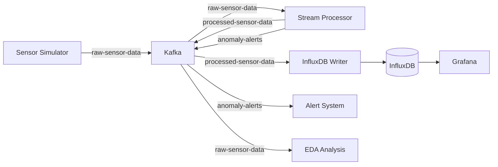

```markdown
<div align="center">
  <h1>🚀 IoT Anomaly Detection System</h1>
  <p><strong>A Complete Real-time Anomaly Detection System for IoT Sensor Data</strong></p>
  
  
  
  
  
  
</div>

---

## 📋 Table of Contents
- [Overview](#-overview)
- [Features](#-features)
- [Architecture](#-architecture)
- [Prerequisites](#-prerequisites)
- [Quick Installation](#-quick-installation)
- [Usage Guide](#-usage-guide)
- [Detailed Components](#-detailed-components)
- [Visualizations](#-visualizations)
- [Project Structure](#-project-structure)
- [Troubleshooting](#-troubleshooting)
- [Future Enhancements](#-future-enhancements)
- [Contributing](#-contributing)

---

## 🔍 Overview

This is a complete real-time system for processing and analyzing IoT sensor data. The system simulates multiple sensors, processes data streams, detects anomalies, stores time-series data, and provides comprehensive visualization capabilities.

### ✨ Why This Project?
- **Educational**: Understand how to build a complete data streaming pipeline
- **Scalable**: Can be extended to handle thousands of sensors
- **Production-Ready**: Uses reliable technologies like Kafka and InfluxDB
- **Easy Deployment**: Fully automated with PowerShell scripts

---

## ⭐ Features

| Feature | Description |
|---------|-------------|
| **🔄 Real-time Processing** | Ingest and process data as it arrives |
| **📊 EDA Analysis** | Statistical analysis and interactive visualizations |
| **🚨 Alert System** | Instant notifications when anomalies are detected |
| **💾 Time-Series Storage** | Store data in InfluxDB for future analysis |
| **📈 Visualization** | Grafana dashboards for performance monitoring |
| **🐳 Docker Support** | Easy deployment with Docker containers |
| **⚡ Full Automation** | PowerShell scripts for one-click start/stop |
| **📝 Live Analytics** | Real-time EDA on streaming data |

---

## 🏗️ Architecture



### Data Flow:
1. **Sensor Simulator** generates data and sends to Kafka
2. **Stream Processor** consumes data and detects anomalies
3. **InfluxDB Writer** stores processed data
4. **Alert System** displays real-time notifications
5. **EDA Analysis** performs statistical analysis

---

## 📋 Prerequisites

- **Docker & Docker Compose** (v24.0+)
- **Python 3.8+**
- **Git** (optional)
- **Windows 10/11** (for PowerShell scripts)
- **8GB RAM** (recommended)

---

## ⚡ Quick Installation

### 1️⃣ Clone the Repository
```bash
git clone https://github.com/yourusername/iot-anomaly-detection.git
cd iot-anomaly-detection
```

### 2️⃣ Install Python Requirements
```bash
pip install -r requirements.txt
```

### 3️⃣ Run the System (One Magic Command!)
```powershell
.\run_system.ps1
```
**What this script does:**
- ✅ Starts Docker containers (Kafka, Zookeeper, InfluxDB, Grafana)
- ✅ Creates required Kafka topics
- ✅ Launches sensor simulator
- ✅ Starts stream processor
- ✅ Runs InfluxDB writer
- ✅ Activates alert system
- ✅ Launches both batch and live EDA analysis

### 4️⃣ Stop the System
```powershell
.\stop_system.ps1
```

---

## 🎮 Usage Guide

### Available Services After Startup:

| Service | URL | Credentials |
|---------|-----|-------------|
| **Kafka UI** | http://localhost:8080 | - |
| **InfluxDB** | http://localhost:8086 | token: `my-super-token` |
| **Grafana** | http://localhost:3000 | admin / admin123 |

### Run Components Individually:

```bash
# Run only sensor simulator
cd src/simulation
python sensor_simulator.py

# Run stream processor
cd src/processing
python stream_processor.py

# Run batch EDA analysis
cd src/analysis
python eda_analysis.py

# Run live EDA analysis
cd src/analysis
python live_eda.py
# Then choose mode (1) for one-time analysis or (2) for continuous analysis
```

---

## 🔧 Detailed Components

### 1️⃣ Sensor Simulator (`sensor_simulator.py`)
Simulator generating data for 5 sensor types:

| Sensor ID | Type        | Unit | Normal Range | Anomaly Threshold |
|-----------|-------------|------|--------------|-------------------|
| TEMP_001  | temperature | °C   | 20-40        | 55                |
| HUM_001   | humidity    | %    | 40-60        | 80                |
| VIB_001   | vibration   | g    | 0.1-0.5      | 1.5               |
| GAS_001   | gas         | ppm  | 50-200       | 400               |
| SMOKE_001 | smoke       | ppm  | 0-50         | 300               |

### 2️⃣ Stream Processor (`stream_processor.py`)
- Consumes data from `raw-sensor-data` topic
- Detects anomalies using predefined thresholds
- Sends processed data to `processed-sensor-data` topic
- Routes alerts to `anomaly-alerts` topic

### 3️⃣ EDA Analysis (`eda_analysis.py` & `live_eda.py`)
- **Basic Statistics**: Record count, time range, sensor types
- **Visualizations**: Time series, distributions, box plots, correlations
- **Anomaly Analysis**: Hourly patterns, sensor-type distribution
- **Data Export**: Export clean data to CSV

### 4️⃣ Alert System (`alert_system.py`)
Formatted alert display:
```
================= NEW ALERT =================
 Sensor: smoke
 Location: zone_d
 Value: 450.23 ppm
 Level: CRITICAL
 Time: 2024-01-15T10:30:45.123Z
=============================================
```

---

## 📊 Visualizations

### EDA Visualizations Available:

1. **Time Series Plots**
   - View all sensor readings over time
   - Anomaly points highlighted in red

2. **Value Distributions**
   - Histograms for each sensor type
   - Box plots with mean and median

3. **Correlation Matrix**
   - Relationships between different sensor types

4. **Anomaly Patterns**
   - Hourly anomaly distribution
   - Anomaly percentage by sensor type

### Grafana Dashboard:
After system startup, you can:
1. Access Grafana (http://localhost:3000)
2. Add InfluxDB as a data source
3. Create custom dashboards

---

## 📁 Project Structure

```
iot-anomaly-detection/
│
├── 📂 docker/
│   └── docker-compose.yml          # Docker services definition
│
├── 📂 src/
│   ├── 📂 simulation/
│   │   ├── sensor_simulator.py     # IoT sensor simulator
│   │   └── create_topics.py        # Kafka topics creator
│   │
│   ├── 📂 processing/
│   │   ├── stream_processor.py     # Stream processing engine
│   │   └── feature_calculator.py   # Statistical feature calculator
│   │
│   ├── 📂 storage/
│   │   └── influx_writer.py        # InfluxDB data writer
|   |   └── send_data.py  
│   │
│   ├── 📂 alerts/
│   │   └── alert_system.py         # Alert display system
│   │
│   └── 📂 analysis/
│       ├── eda_analysis.py         # Batch EDA analysis
│       └── live_eda.py             # Live streaming EDA
│
├── 📜 requirements.txt              # Python dependencies
├── 📜 run_system.ps1                # System startup script
├── 📜 stop_system.ps1               # System shutdown script
└── 📜 README.md                     # Project documentation
```

---

## 🔍 Troubleshooting

### Issue: Kafka Not Working
```bash
# Check container status
docker ps

# View Kafka logs
docker logs kafka

# Restart Kafka
docker restart kafka
```

### Issue: No Data in InfluxDB
```bash
# Check token in influx_writer.py
# Make sure it matches the token in docker-compose.yml

# Test InfluxDB connection
python src/storage/send_data.py
```

### Issue: Ports Already in Use
```bash
# Find processes using the port
netstat -ano | findstr :9092

# Stop the process (replace PID with the actual number)
taskkill /PID [PID] /F
```

### Issue: Module Import Error
```bash
# Make sure you're in the main project directory
cd D:\iot_anomaly_detection

# Reinstall requirements
pip install -r requirements.txt
```

---

## 🚀 Future Enhancements

- [ ] **Advanced Machine Learning Algorithms**: Isolation Forest, LSTM
- [ ] **Distributed Processing**: Apache Flink or Spark Streaming
- [ ] **Additional Sensors**: Pressure, current, voltage
- [ ] **Web Dashboard**: React dashboard for analytics
- [ ] **MQTT Integration**: Receive data from real IoT devices
- [ ] **Long-term Storage**: Relational database for metadata
- [ ] **Advanced Notifications**: Telegram, Email, Slack
- [ ] **Predictive Analysis**: Predict failures before they occur

---

## 🤝 Contributing

Contributions are welcome! To contribute:

1. Fork the project
2. Create a new branch (`git checkout -b feature/amazing-feature`)
3. Commit your changes (`git commit -m 'Add amazing feature'`)
4. Push to the branch (`git push origin feature/amazing-feature`)
5. Open a Pull Request

### Contribution Guidelines:
- Follow existing code style
- Add comments to new code
- Update documentation when necessary
- Ensure all tests pass

---


## 📞 Contact

- **Email**: renad1132005@gmail.com
- **GitHub**: [@renadaa113](https://github.com/renadaa113)

---

<div align="center">
  <sub>Built with ❤️ for IoT and Data Engineering</sub>
  <br>
  <sub>© 2024 IoT Anomaly Detection System</sub>
</div>
```
